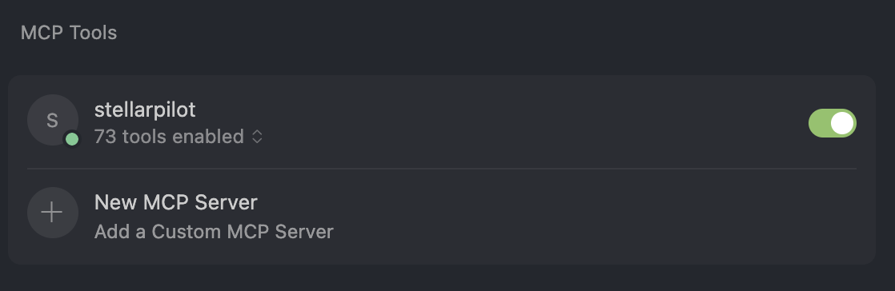
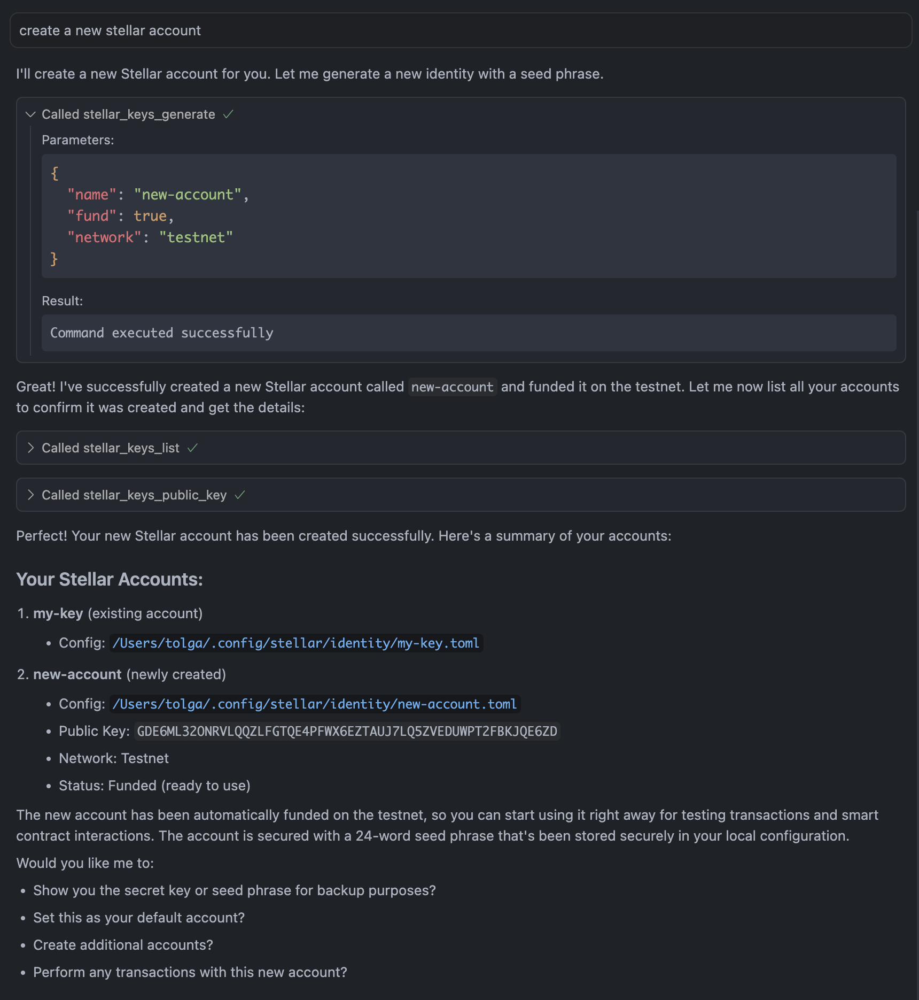

# Stellar Pilot — MCP Server for Stellar


Stellar Pilot bridges natural language and the Stellar blockchain. It's an **MCP server that translates what you want to do** into the exact CLI commands needed to do it.

**Stop fighting with Stellar CLI syntax.** The Stellar CLI has:
- 10+ main commands (`contract`, `keys`, `tx`, `network`...)
- 70+ subcommands with unique syntax
- Hundreds of flags and parameters to remember

Stellar Pilot lets you skip all that. **Just say what you need**:
- **"create a new account"** instead of `stellar keys generate --network testnet --fund`
- **"deploy my contract"** instead of `stellar contract deploy --wasm path --source account --network...`
- **"send 100 XLM to Bob"** instead of `stellar tx new payment --destination G... --amount...`

It translates natural language to proper CLI commands through MCP (Model Context Protocol), working seamlessly in AI assistants and IDEs.

## 🚀 Features

- **73+ CLI Tools**: Complete integration with the official Stellar CLI
- **Smart Contract Operations**: Deploy, invoke, build, and optimize Soroban contracts
- **Transaction Management**: Send payments, create accounts, manage trustlines, DEX trading
- **Identity & Key Management**: Generate keys, manage accounts, fund testnet accounts
- **Network Configuration**: Switch between testnet, mainnet, futurenet, and local networks
- **Type-Safe Interface**: Full TypeScript support with schema validation

## 📋 Prerequisites

- **Node.js 18+** - Check with `node --version`
- **Stellar CLI** - Check with `stellar --version`

  If not installed, see: https://github.com/stellar/stellar-cli

## 📦 Installation

```bash
npm install -g stellarpilot
```

## ⚙️ Configuration

Add to your MCP settings:

- **macOS**: `~/Library/Application Support/Claude/claude_desktop_config.json`
- **Windows**: `%APPDATA%/Claude/claude_desktop_config.json`

```json
{
  "mcpServers": {
    "stellarpilot": {
      "command": "stellar-pilot"
    }
  }
}
```

**Successful Configuration:**
Once properly configured, you'll see StellarPilot with 73 tools enabled in your MCP Tools panel:



## 🎯 Basic Usage Examples

Once configured, you can use natural language to interact with Stellar:

### Account Management
```
"Generate a new account called alice"
"Fund alice's account on testnet"
"Show me alice's public key"
"Switch to using alice as default"
```

**Example: Creating a New Account**



StellarPilot automatically:
- Generates a new keypair with secure seed phrase
- Funds the account on testnet
- Stores credentials securely in local configuration
- Lists all your accounts with their details

### Payments
```
"Send 100 XLM from alice to GDEXAMPLE..."
"Create a trustline for USDC:GCKFBEIYTKP..."
"Send 50 USDC from alice to bob"
```

### Smart Contracts
```
"Deploy my contract from ./contract.wasm"
"Call the hello function on contract C123..."
"Build the contract in ./my-project"
```

### Network Operations
```
"Switch to testnet"
"Check network health"
"Add a custom network called mynet"
```

## 🛠️ Available Tools

StellarPilot provides 73+ tools organized into these categories:

- **Contract Operations** (15 tools): Deploy, invoke, build, optimize contracts
- **Transaction Management** (16 tools): Payments, trustlines, DEX operations
- **Key Management** (8 tools): Generate, add, fund, manage identities
- **Network Configuration** (7 tools): Add networks, check health, switch networks
- **Ledger Operations** (2 tools): Get ledger info, fetch latest ledger
- **Events** (1 tool): Watch contract events
- **XDR Operations** (7 tools): Encode, decode, sign, verify XDR
- **Cache Management** (4 tools): Clean, list, manage transaction cache
- **Development Tools** (13+ tools): Doctor, completion, version, plugins, etc.

## 🔧 Development

### Project Structure

```
stellarpilot/
├── src/
│   ├── index.ts              # Main MCP server
│   ├── modules/
│   │   └── cli/              # Stellar CLI integration
│   │       ├── tools/        # Tool definitions
│   │       ├── handlers/     # Command handlers
│   │       └── types/        # TypeScript types
│   └── types/                # Shared types
├── build/                    # Compiled output
├── package.json
└── tsconfig.json
```

### Building from Source

```bash
# Install dependencies
npm install

# Development mode (watch for changes)
npm run dev

# Production build
npm run build

# Start the server
npm start
```

## 🚨 Troubleshooting

### Common Issues

1. **"stellar command not found"**
   - Install Stellar CLI: https://developers.stellar.org/docs/tools/developer-tools
   - Verify with `stellar --version`

2. **"stellar-pilot command not found"**
   - For global install: `npm install -g stellarpilot`
   - For local build: Use absolute path in MCP config

3. **"Permission denied"**
   - Check file permissions: `chmod +x build/index.js`
   - For global install: May need `sudo npm install -g stellarpilot`

4. **"Tools not loading in Claude"**
   - Restart your IDE or IDE plugin after config changes
   - Be sure you are using the correct config syntax
   - Verify file paths are absolute

## 🌟 Roadmap

- [X] **Phase 1**: CLI Integration (Complete)
- [ ] **Phase 2**: Enhanced Error Handling & Validation
- [ ] **Phase 3**: Horizon API Integration
- [ ] **Phase 4**: Direct SDK Integration
- [ ] **Phase 5**: Documentation RAG System
